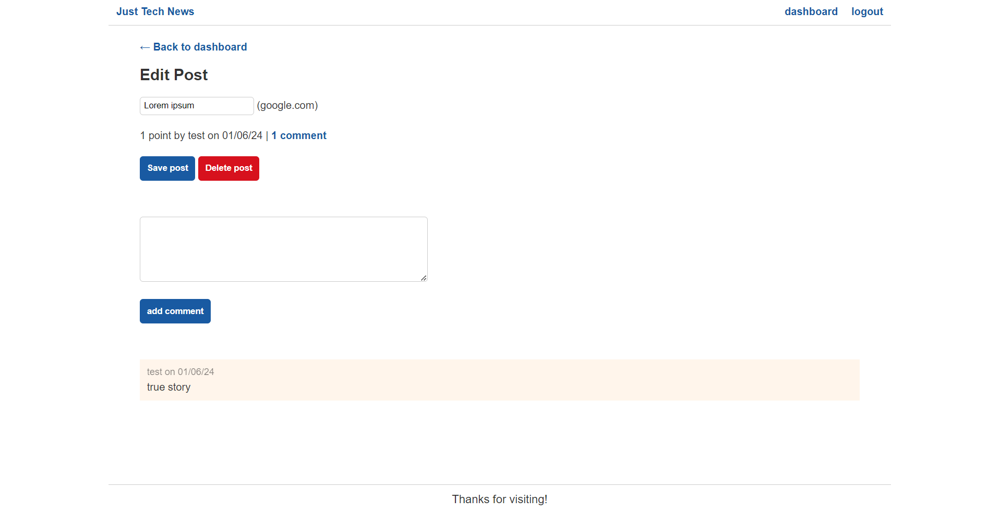

# Python Pulse

## Description

- A Node.js newsfeed application in which Python is used to handle server-side logic

  ## Table of Contents

  - [Installation](#installation)
  - [User Story](#user-story)
  - [Questions](#questions)
  - [Link](#link-to-site)

  ## Installation

  - Python
  - PyPI
  - Flask
  - SQLAlchemy
  - PyMySQL
  - bcrypt
  - python-dotenv
  - Gunicorn

  ## User Story

  - Objective:

    As a developer, I want to build and deploy a Flask API with an organized project structure and necessary dependencies. The API should connect to an RDBMS database using SQL Alchemy to support the application model and implement CRUD operations via a RESTful API. Additionally, I aim to set up a local virtual environment for Python Flask, incorporate templating for user interactions, and perform basic DevOps tasks for seamless deployment to a cloud infrastructure.

  - Tasks:

    Project Setup:
    Organize the project structure appropriately for a Flask application.
    Install necessary dependencies to support Flask development.
    
    Database Integration:
    Connect the Flask application to an RDBMS database using SQL Alchemy.
    Implement the necessary database models to support the functionality of the API.
    
    REST API Development:
    Create REST API endpoints to perform CRUD operations (Create, Read, Update, Delete) on the application's resources.
    Ensure proper handling of HTTP requests and responses.

    Local Environment Setup:
    Configure a local virtual environment for Python Flask to isolate project dependencies.
    
    Language Comparison:
    Provide an explanation of the key differences between JavaScript and Python, highlighting their use cases and strengths.
    
    Templating for User Interactions:
    Incorporate templating into the application to enhance user interactions and improve the overall user experience.

    DevOps and Deployment:
    Perform basic DevOps tasks, such as version control and continuous integration.
    Deploy the Flask API to a cloud infrastructure for accessibility and scalability.

  - Acceptance Criteria:

    The Flask API should have a clear project structure and all necessary dependencies installed.

    CRUD operations should be supported through well-defined REST API endpoints.
    
    The application should connect to an RDBMS database using SQL Alchemy.
    
    A local virtual environment must be set up for Python Flask development.

    The README should include a comparison of JavaScript and Python.

    Templating should be implemented to enhance user interactions.

    Basic DevOps tasks should be performed, and the API should be successfully deployed to a cloud infrastructure.

  ## Questions

  - Please email questions to joseph.s.foster@icloud.com.

  - For additional works, please visit https://github.com/joseph-s-foster.

  ## Link to site

  - https://python-pulse-a33bae0b4181.herokuapp.com/

  ## Screenshot

  